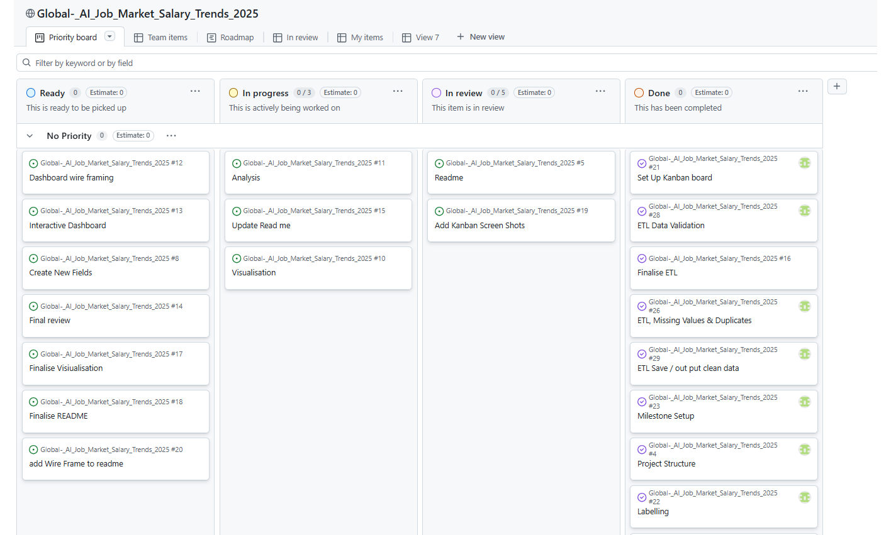
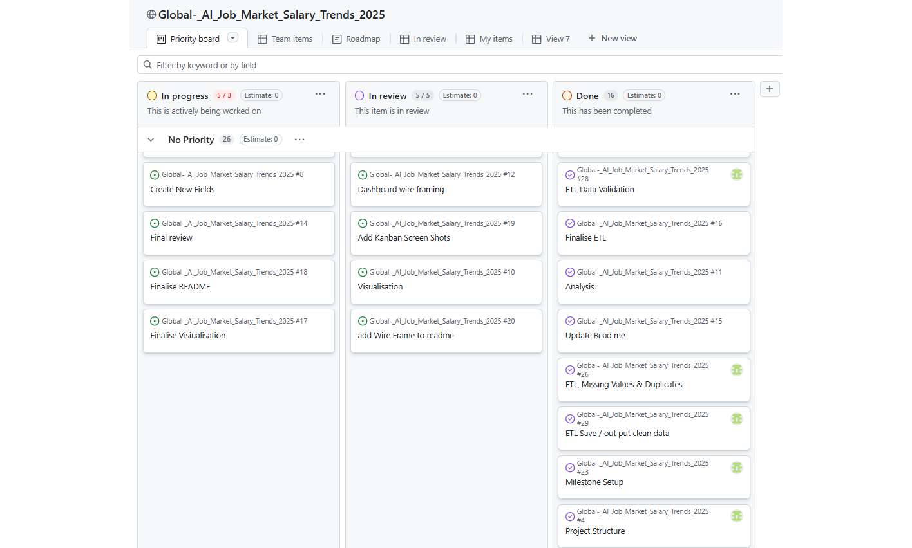

# Global AI Job Market & Salary Trends 2025

- Here is the Initial Project Plan and Kanban board for the project.
- The project is managed using Agile and Sprint methodologies.
- The project is divided into several sprints, each focusing on specific tasks such as data collection, cleaning, analysis, and visualization.
- The Kanban board is used to track the progress of tasks, with columns for "To Do", "In Progress", and "Done".

