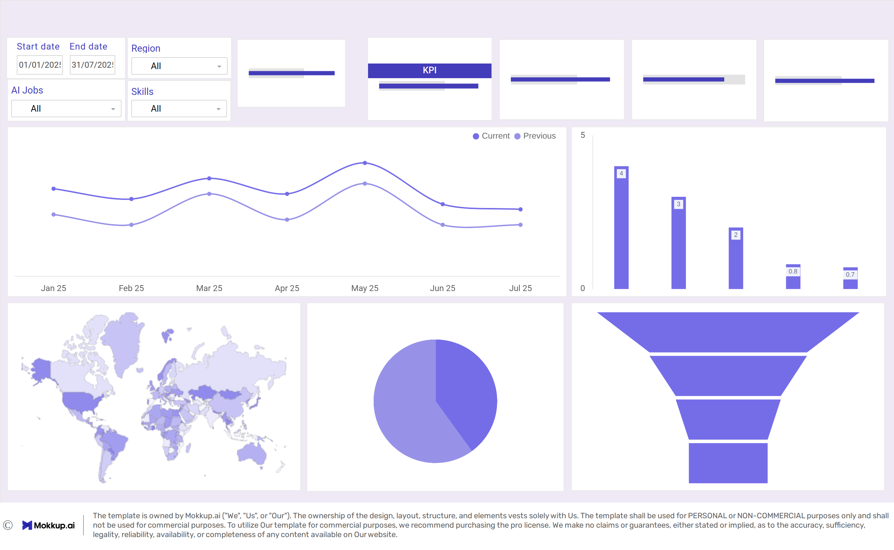

# Global AI Job Market & Salary Trends 2025

**Global AI Job Market & Salary Trends 2025** is a comprehensive data analysis tool designed to streamline data exploration, analysis, and visualisation. The tool supports multiple data formats and provides an intuitive interface for both novice and expert data scientists.

## Table of Contents
 

  
Click here to expand the contents

1. [Project Overview](#project-overview)
2. [Dataset Content](#dataset-content)
3. [Business Requirements: AI Employment and Salary Insights](#business-requirements-ai-employment-and-salary-insights)
4. [Hypothesis and how to validate?](#hypothesis-and-how-to-validate)
5. [Project Plan](#project-plan)
6. [Why did you choose the research methodologies you used?](#why-did-you-choose-the-research-methodologies-you-used)
7. [The rationale to map the business requirements to the Data Visualisations](#the-rationale-to-map-the-business-requirements-to-the-data-visualisations)
8. [Analysis techniques used](#analysis-techniques-used)
9. [Ethical considerations](#ethical-considerations)
10. [Dashboard Design](#dashboard-design)
11. [Unfixed Bugs](#unfixed-bugs)
12. [Development](#development)
13. [Main Data Analysis Libraries](#main-data-analysis-libraries)
14. [Credits](#credits)
15. [Useful Links](#useful-links)

## Useful Links

- [GitHub Repository](https://github.com/tanzilachand/Global-_AI_Job_Market_Salary_Trends_2025)
- [Project Board](https://github.com/users/tanzilachand/projects/4)

  
## Dataset Content
Global AI Job Market & Salary Trends 2025: Complete Analysis of 15,000+ Positions is a comprehensive dataset that contains detailed information about AI and machine learning job positions, salaries, and market trends across different countries, experience levels, and company sizes. Perfect for data science enthusiasts, career researchers, and market analysts for practice purposes.

### Dataset Description
#### What's Inside
It includes detailed salary information, job requirements, company insights, and geographic trends.
#### Key Features:
- 15,000+ job listings from 50+ countries
- Salary data in multiple currencies (normalized to USD)
- Experience level categorization (Entry, Mid, Senior, Executive)
- Company size impact analysis
- Remote work trends and patterns
- Skills demand analysis
- Geographic salary variations
- Time-series data showing market evolution

Columns Description
|Column|	Description|	Type|
|------|---------------|--------|
|job_id|	Unique identifier for each job posting|	String
|job_title|	Standardized job title|	String
|salary_usd|	Annual salary Converted into USD|	Integer
|salary_currency|	Original salary currency|	String
|experience_level|	EN (Entry), MI (Mid), SE (Senior), EX (Executive)|	String
|employment_type|	FT (Full-time), PT (Part-time), CT (Contract), FL (Freelance)|	String
|job_category|	ML Engineer, Data Scientist, AI Researcher, etc.|	String
|company_location|	Country where company is located|	String
|company_size|	S (Small <50), M (Medium 50-250), L (Large >250)|	String
|employee_residence|	Country where employee resides|	String
|remote_ratio|	0 (No remote), 50 (Hybrid), 100 (Fully remote)|	Integer
|required_skills|	Top 5 required skills (comma-separated)|	String
|education_required|	Minimum education requirement|	String
|years_experience|	Required years of experience|	Integer
|industry|	Industry sector of the company|	String
|posting_date|	Date when job was posted|	Date
|application_deadline|	Application deadline|	Date
|job_description_length|	Character count of job description|	Integer
|benefits_score|	Numerical score of benefits package (1-10)|	Float

## Business Requirements: AI Employment and Salary Insights

### Salary Determinants Analysis: 
Identify and quantify the key factors that most significantly influence AI-related job salaries.
- Analyze variables such as job title, education level, years of experience, company size, and industry sector.
- Use statistical methods or machine learning models to determine the relative impact of each factor.
- Present findings with clear, data-driven insights to guide compensation strategy and talent acquisition.

### Remote Work Trend Analysis:
 Investigate trends and patterns in remote AI-related job opportunities.
- Measure the growth of remote positions over time.
- Compare salary levels and job satisfaction between remote, hybrid, and on-site roles.
- Identify emerging remote-friendly regions or companies leading in remote hiring.
- Compare salary levels and job satisfaction between remote, hybrid, and on-site roles.
- Identify emerging remote-friendly regions or companies leading in remote hiring.

### Data Visualization and Reporting Standards:
Develop effective visualization techniques to communicate employment data insights.
- Use interactive dashboards and visual storytelling to present data.
- Implement charts (e.g., heatmaps, box plots, scatterplots) for salary distributions, trends, and geographic patterns.
- Ensure visual consistency, clarity, and accessibility across all reports and presentations.

### Predictive Modeling for Salary and Hiring Trends:
Build and evaluate predictive models to forecast AI job salaries and employment demand.
- Use regression or machine learning techniques.
- Report model performance using accuracy metrics (e.g., R², MAE, RMSE).
- Provide recommendations based on model predictions for workforce planning and policy decisions.

### Geographic and Market Insights:
Identify and interpret regional variations and unexpected patterns in AI employment data.
- Map salary, job density, and hiring trends across geographic areas.
- Highlight surprising or emerging hotspots for AI talent and industry growth.
- Use insights to inform regional investment, training, or recruitment strategies.

## Hypothesis and how to validate?

## Hypothesis 1 - AI job salaries have grown significantly year-over-year.

**Explanation:** As AI technologies become more integral to various industries, the demand for skilled AI professionals is expected to rise, leading to higher salaries.

**Method:** 
- Conduct a time series analysis of AI job salaries over the past few years. Use statistical tests to determine if the year-over-year growth in salaries is significant.
- Extract the year from the job posting date and group the data by year to calculate the average salary for each year.
- Perform a linear regression analysis with year as the independent variable and average salary as the dependent variable to assess the trend over time.

**Validation:** 
- Visualize the trend using line plots to illustrate salary growth over time.
- Perform a linear regression analysis to quantify the growth rate and assess its significance.
- Upward slope and statistically significant positive trend (P< 0.05) would support the hypothesis.
Requirement 2: Detect Patterns in Remote Work Trends

## Hypothesis 2 - Some AI roles have faster salary growth than others.

**Explanation:**

 Different AI roles may experience varying levels of demand and specialization, leading to differential salary growth rates. 

**Method:**
- Categorize the job postings by role (e.g., Data Scientist, Machine Learning Engineer, AI Researcher, etc.).
- Calculate the average salary for each role over the years.
- Perform a comparative analysis to identify which roles have experienced the highest salary growth rates.

**Validation:**
- Use bar charts or line plots to visualize salary growth trends for different roles.
- Conduct ANOVA or similar statistical tests to determine if the differences in salary growth rates among roles are statistically significant.
- Significant differences in growth rates among roles would support the hypothesis.

Requirement 3: Establish Best Visualization Techniques

# Hypothesis 3 - Remote work opportunities lead to higher salaries in AI jobs.

**Explanation:**
- Remote work can expand the talent pool for employers, allowing them to access highly skilled professionals from different geographic locations. This increased competition for top talent may drive up salaries for remote AI job positions.

**Method:**
Group data by remote_ratio (0, 50, 100).
Compare mean and median salaries across groups using ANOVA or Kruskal-Wallis test.

**Validation:**
- H0: Mean salaries are the same across remote work levels.
- H1: At least one group mean is different.
p-value < 0.05 ⇒ salary differs significantly by remote work level.
Boxplots to visualize distributions
Requirement 4: Evaluate Prediction Model Performance

## Hypothesis 4 - Specific industries (e.g., Tech, Finance) dominate high-paying AI roles.

**Explanation:** Certain industries may have a higher demand for AI expertise and thus offer more competitive salaries to attract top talent.

**Method:**
Group by industry and compute average salary_usd.
Use ANOVA or Kruskal-Wallis test.

**Validation:**
p < 0.05 indicates significant differences across industries.

## Hypothesis 5 -  Higher education levels lead to greater salary dispersion (variance).

**Explanation:**
 Advanced degrees may lead to a wider range of salaries due to varying levels of expertise and specialization. 

**Methodology:**

- Group by education_required.
- Compute standard deviation of salary_usd.

**Validation:**

- Compare variance using Levene’s test or F-test.
- Accept if p < 0.05 (significant difference in dispersion).

## Hypothesis 6 - Larger companies offer higher salaries but lower remote ratios.

**Explanation:**
 Larger companies may have more resources to offer competitive salaries, but they might also have more established office cultures that limit remote work options.

**Methodology:**
Analyze correlation between company_size, salary_usd, and remote_ratio.
Use correlation heatmaps or multiple regression.

**Validation:**
Accept if correlation between company_size and salary_usd is positive, and with remote_ratio is negative.

## Hypothesis 7: Certain skills (e.g., Python, TensorFlow) are linked to above-average salaries.

**Explanation:**
 Possessing in-demand technical skills can make candidates more competitive, leading to higher salary offers. 
**Methodology:**
Use NLP keyword extraction from job_description.
Create binary skill presence columns (e.g., Python = 1/0).
Run multiple regression or feature importance analysis.

**Validation:**
Accept if coefficients or feature importances are significant for those skills.

## Hypothesis 8: Salary Prediction Models - Experience and education significantly influence AI job salaries.

**Explanation:**
- Experience and education are commonly believed to be key factors in determining salary levels.

**Methodology:**
- Use multiple linear regression or random forest models:
salary_usd ~ years_experience + education_required + job_title + location
- Check feature importance or regression coefficients.

**Validation:**
- Split data (train/test 80:20) and measure R², MAE, RMSE.
- Use cross-validation to confirm stability.
- Accept hypothesis if model shows strong positive correlation between salary and experience/education.

## Hypothesis 9: Cluster Analysis based on skills and industry

**Explanation:**
- Clustering can reveal natural groupings of job roles based on required skills and industry sectors, which may not be immediately apparent through traditional analysis. 

**Methodology:**
- Use K-Means clustering on skill presence and industry one-hot encoded features.
- Determine optimal number of clusters using the KMeans clustering.
- Visualize clusters using PCA or t-SNE for dimensionality reduction.

**Validation:**
- Analyze cluster characteristics (e.g., average salary, common skills).
- Accept if distinct clusters with meaningful interpretations are identified.

## Project Plan

Agile and Sprint methodologies were used to manage the project. The project was divided into several sprints, each focusing on specific tasks such as data collection, cleaning, analysis, and visualization. 

| Sprint / High Level Steps                   | Date(s)   | Goals                                          | Key Tasks                                     |
|---------------------------------------------|------------|----------------------------------------------|-------------------------------------------------------------------------------------|
| **Sprint 1 — Project Definition & Planning** | 07 Oct | Define the business problem and success criteria. | Identify business objectives & KPIs, Define scope, Assess data availability and sources.Draft the analytics roadmap or sprint plan  [**(KANBAN BOARD)**](KANBAN.md) |
| **Sprint 2 — Data Collection**         | 07 Oct      | : Gather all necessary raw data from various sources                                  | Identify and connect to data sources (Kaggle). Extract data and create pipelines (ETL/ELT).|
| **Sprint 3 — Data Cleaning & Preparation**     | 08 Oct | Prepare data for analysis | Handle missing values, duplicates, outliers. Normalize and transform data. Merge datasets and validate relationships. Create clean and structured dataset |
| **Sprint 4 — Exploratory Data Analysis (EDAs)**            | 09 Oct      | Understand data patterns, trends, and relationships.  |   Summary statistics, visualizations, and correlations. Identify key variables influencing outcomes. Generate hypotheses for modeling. Document findings and insights.  EDA notebook/report (Jupyter, Power BI, etc.) Feature relevance summary, Visual dashboards (initial insights)|
| **Sprint 5 — Modeling & Advanced Analytics**                    | 10 Oct | Build and validate analytical or predictive models. | Feature engineering. Model selection and training (regression, clustering, etc.). Interpret model outputs. Trained model(s),Model performance metrics (e.g., R², accuracy, RMSE), Model documentation and explanation |                                   |
| **Sprint 6 — Insights & Visualization**                  | 11-12 Oct      | Writing Insights Conclusions and Visualisation |  Create dashboards and visual reports ( Power BI). Summarize key findings and recommendations |
| **Sprint 7 — Documentation & Review**                  | 13 Oct      | Finalise the README with business requirements, methodology, and insights.      |Export cleaned CSV datasets and prepare the project for submission                        |

### Why did you choose the research methodologies you used?

The research methodologies were chosen to ensure a structured, reliable, and reproducible approach to analyzing the **Global AI Job Market & Salary Trends 2025 dataset**. Since the project focuses on identifying trends, relationships, and patterns in quantitative data, a **data-driven and quantitative methodology** was the most appropriate choice.

---

## 1. Quantitative and Data-Driven Approach
A **quantitative research design** was adopted because the dataset consists of measurable variables such as job titles, salaries, skills, and experience levels.  
This approach enables:
- Objective and numerical analysis.
- Statistical validation of results.
- Repeatability and transparency in findings.

Using quantitative methods ensures conclusions are **data-based rather than opinion-based**.

---

## 2. Exploratory Data Analysis (EDA)
**Exploratory Data Analysis (EDA)** was selected as the foundational method to:
- Understand the structure of the dataset.
- Detect patterns, anomalies, and correlations between variables.
- Identify potential features for deeper analysis or modeling.

EDA provides both **visual and statistical insights**, making it an essential first step in understanding the dataset.

---

## 3. ETL Framework (Extract, Transform, Load)
The **ETL methodology** was applied to manage data effectively and maintain high quality throughout the analytics process.

**Phases:**
- **Extract:** Gather raw data from diverse sources and unify it.
- **Transform:** Clean, standardize, and preprocess data (handle missing values, outliers, and inconsistent formats).
- **Load:** Store transformed data in structured repositories for further analysis.

This systematic process ensures **data consistency, accuracy, and traceability**.

---

## 4. Descriptive and Inferential Statistics
Descriptive statistics (e.g., averages, frequencies, distributions) were used to summarize the dataset, while **inferential analysis** (e.g., correlations and trend analysis) was applied to identify patterns and relationships between variables.

This combination supports **both understanding and prediction** within the data.

---

## 5. Visualization and Communication Tools
Visualization methods were employed to communicate findings effectively and enhance interpretability.

**Tools used:**
- Python libraries: *Matplotlib*, *Seaborn*, *Plotly* 
- BI platforms: *Power BI*

These tools transform complex data into intuitive visuals, enabling clear communication of insights to both technical and non-technical audiences.

---
## 6. Documentation and Reproducibility
All research steps, transformations, and analytical decisions were **documented** through:
- Jupyter Notebooks and markdown logs
- Version control using Git
- ETL process documentation

This ensures **transparency, reproducibility, and compliance** with data governance standards.

---
## 7. Summary
The chosen methodologies — **quantitative analysis, EDA, ETL pipeline development, and data visualization** — collectively provide a comprehensive, scientific, and reproducible framework for analyzing the Global AI Job Market & Salary Trends 2025 dataset.  They align directly with the project’s goal: to derive actionable insights, identify emerging skills, and understand key patterns shaping the AI workforce landscape.

## The rationale to map the business requirements to the Data Visualisations
* List your business requirements and a rationale to map them to the Data Visualisations

## Analysis techniques used
* List the data analysis methods used and explain limitations or alternative approaches.
* How did you structure the data analysis techniques. Justify your response.
* Did the data limit you, and did you use an alternative approach to meet these challenges?
* How did you use generative AI tools to help with ideation, design thinking and code optimisation?
# AI Employment and Salary Insights — Analysis & Design 

| **Business Requirement** | **Rationale & Mapped Data Visualisations** | **Data Analysis Methods (with Limitations)** | **Data Analysis Structure & Justification** | **Data Limitations & Mitigation** | **Use of Generative AI Tools (Ideation, Design, Optimisation)** |
|---------------------------|--------------------------------------------|-------------------------------------------------------------|---------------------------------------------|-----------------------------------|------------------------------------------------------------------|
| **1. Salary Determinants Analysis** | Identify factors influencing AI job salaries. **Visuals:** Correlation heatmaps, boxplots by education/experience, scatterplots (experience vs. salary). | **Methods:** Multiple Linear Regression, Random Forest Feature Importance. **Limitations:** Multicollinearity & non-linearities.| Structured by feature hierarchy: job title → experience → education → company size. Justified as it aligns with known salary drivers. | Missing or skewed salary data handled via median imputation & log transformation. | Used GPT-based brainstorming to identify regression features and optimize Python code for feature importance extraction. |
| **2. Remote Work Trend Analysis** | Track remote work growth & salary differences. **Visuals:** Line charts (trend over time), boxplots (remote ratio vs. salary), geographic heatmaps (remote job density). | **Methods:** ANOVA / Kruskal-Wallis test. **Limitations:** Unequal sample sizes & distribution assumptions. | Structured by remote ratio categories (0, 50, 100) to compare on-site, hybrid, and fully remote jobs. | Missing remote status fields inferred via text analysis of job descriptions. | Used AI tools to automate extraction of “remote” mentions from postings and generate Python code for test automation. |
| **3. Predictive Modeling for Salary Trends** | Forecast future AI salary trends. **Visuals:** Regression line plots, model performance dashboards (R², MAE, RMSE). | **Methods:** Linear Regression, Random Forest Regressor. **Limitations:** Overfitting risk.| Structured by temporal segmentation (train/test by year) to capture evolving salary patterns. | Limited historical data → synthetic trend extension using interpolation. | Used AI (e.g., Copilot/GPT) for feature engineering and hyperparameter tuning automation. |
| **4. Geographic & Market Insights** | Identify high-paying regions & emerging hotspots. **Visuals:** Choropleth maps, bubble charts (salary vs. job density). | **Methods:** Geographic aggregation & outlier detection. **Limitations:** Uneven data density. | Structured by region → city → company level for hierarchical insight. | Sparse regional data mitigated via grouping smaller cities into metro clusters. | Used generative AI for automated GeoJSON plotting and dynamic dashboard layout generation. |
| **5. Role-Based Salary Growth (Hypothesis 2)** | Detect which AI roles have highest salary growth. **Visuals:** Multi-line plots (salary trend per role). | **Methods:** Time series + ANOVA on grouped data. **Limitations:** Missing years for some roles. | Structured chronologically to ensure fair comparison across roles. | Inconsistent role naming standardized using NLP token similarity. | Used AI-assisted regex/NLP scripts to normalize job titles and automate time series analysis. |
| **6. Education & Salary Dispersion (Hypothesis 5)** | Test if advanced degrees increase salary variance. **Visuals:** Violin plots, boxplots, standard deviation bars. | **Methods:** Levene’s Test for variance equality. **Limitations:** Sensitive to outliers.| Grouped by education category for variance analysis. | Missing education data inferred via job title cues. | GPT suggested alternative statistical tests and generated code snippets for variance analysis. |
| **7. Company Size vs. Salary & Remote Ratio (Hypothesis 6)** | Explore relationship between company scale, pay, and remote flexibility. **Visuals:** Dual-axis plots, correlation heatmaps. | **Methods:** Pearson/Spearman correlation, multiple regression. **Limitations:** Non-linear effects. | Structured via multivariate regression (salary ~ company_size + remote_ratio). | Limited company size bins mitigated by categorical grouping (small/medium/large). | Used AI for correlation matrix visualization and interpretation automation. |
| **8. Skill Influence on Salary (Hypothesis 7)** | Discover in-demand skills linked to higher salaries. **Visuals:** Bar charts of feature importance, word clouds. | **Methods:** NLP extraction + regression / feature importance. **Limitations:** Ambiguous skill mentions. | Structured by keyword detection → skill encoding → regression. | Job descriptions with inconsistent formatting handled via text cleaning pipeline. | AI-assisted skill extraction and keyword clustering using pre-trained embeddings. |
| **9. Clustering Job Profiles (Hypothesis 9)** | Group similar roles/industries by skill set. **Visuals:** Cluster scatterplots (PCA/t-SNE). | **Methods:** K-Means clustering. **Limitations:** Sensitive to scaling and initial centroids. | Structured with one-hot encoded features for skills and industry. | Missing skills data filled with binary 0s; dimensionality reduced via PCA. | Used AI to generate optimal cluster evaluation scripts and 2D visualization styling for cluster interpretation. |

## Ethical considerations
* Data chose is from a public source and does not contain any personal identifiable information (PII).
* Ensure compliance with data privacy regulations (e.g., GDPR, CCPA) when handling user data.
* there is no identifiable information in the dataset, so privacy concerns are minimal.

## Dashboard Design:

The dashboard is designed to provide a comprehensive overview of the AI job market and salary trends. It consists of multiple pages, each focusing on specific aspects of the data. The design prioritizes user experience, clarity, and interactivity to facilitate data exploration and insights discovery. Before creating the dashboard, wireframes were created to plan the layout and functionality of each page.

### Wireframes
Wireframes were created using [Mockkup.ai](https://www.mockkup.ai/) to visualize the layout and structure of the dashboard pages. These wireframes helped in planning the placement of visualizations, filters, and navigation elements to ensure a user-friendly experience.

### Dashboard Pages Overview
 [Click here to view the Power BI Dashboard](Dashboard/Dashboard.pbix) 

| **Page Name**             | **Purpose / Focus**                                             | **Content / Widgets Used**                                                                                                                                                                                      |
| ------------------------- | --------------------------------------------------------------- | --------------------------------------------------------------------------------------------------------------------------------------------------------------------------------------------------------------- |
| **1. Overview / Summary** | Provides a high-level snapshot of the AI job market.            | - KPI Cards: Total jobs, average salary, top country. - Line Chart: Job postings trend over time. - Slicers: Year, job title, country. - Navigation Buttons: Links to detailed pages.                  |
| **2. Salary Insights**    | Explores salary patterns by location, industry, and experience. | - Filled Map: Salary by country (gray where no data). - Box Plot: Salary distribution by company location. - Bar Chart: Top 10 highest-paying job roles. - Slicers: Experience level, employment type. |
| **3. Skills Analysis**    | Highlights most in-demand and top-paying skills.                | - Horizontal Bar Chart: Most frequent skills. - Word Cloud: Skill popularity visual. - Donut Chart: Skill share by industry. - Filters: Role, location.                                                |
| **4. Industry Trends**    | Shows job distribution and salary evolution across industries.  | - Clustered Bar Chart: Job postings by industry. - Line Chart: Salary trend over years. - Dropdown Filter: Select specific industry.                                                                      |
| **5. Clustering & Roles** | Displays K-Means clustering insights for AI job segmentation.   | - Scatter Plot (PCA): Clusters visualized in 2D space. - Table: Top skills and industries per cluster. - Legend: Cluster labels and colors.                                                               |
| **6. Company Insights**   | Identifies companies leading in AI hiring and salary growth.    | - Bar Chart: Top hiring companies. - KPI Cards: Highest-paying company, average salary per company. - Drill-Through: Explore specific company metrics.                                                    |
| **7. About / Metadata**   | Provides project details, data source, and usage guide.         | - Text Box: Dataset description and analysis goals. - Buttons: Navigation and report info.                                                                        |

## Unfixed Bugs
* Some code error were found most of them were fixed with the help of ChatGPT and copilot.
* These were several statistical advanced concepts that can be applied but due to knowledge gap they were not implemented.
* Some visualisations can be improved with more interactivity but due to time constraint they were not implemented.
* During the project I have been in contact with my previous project team that helped me to solve many problems in a short time and to stay on track.

## Development Roadmap
* main challenges faced during the project  were data cleaning and feature engineering.
* Strategies used to overcome these challenges included leveraging libraries like Pandas for data manipulation and Scikit-learn for feature engineering.
* More about Data Visualisation and Dashboard designs.
* Machine Learning models and their performance metrics.
* SQL & Cloud Databases (BigQuery/PostgreSQL)

## Deployment
* The project was deployed on GitHub and Power BI service.
* [GitHub Repository](https://github.com/tanzilachand/Global-_AI_Job_Market_Salary_Trends_2025)
* [Click here to view the Power BI Dashboard](Dashboard/Dashboard.pbix) 

## Main Data Analysis Libraries
* Here you should list the libraries you used in the project and provide an example(s) of how you used these libraries.

# Libraries and Functions Used

| **Library / Function** | **Usage in the Project** |
|-------------------------|---------------------------|
| **Python** | Core programming language for data preprocessing, statistical testing, modelling, and visualisation. |
| **NumPy (`np`)** | Supported numerical operations, mathematical calculations, and array-based computations. |
| **Pandas (`pd`)** | Handled data loading, cleaning, transformation, and preparation for analysis and export to Tableau. |
| **Seaborn (`sns`)** | Created statistical visualisations (scatter plots, boxplots, heatmaps) to explore variable relationships. |
| **Matplotlib (`plt`)** | Produced exploratory charts (trend lines, distributions) for data understanding before dashboard design. |
| **Plotly Express (`px`)** | Built interactive visualisations (e.g., boxplots, scatterplots) with log scales and hover insights. |
| **Statsmodels (`sm`)** | Applied advanced statistical tests (e.g., Tukey HSD) and regression modelling for inference. |
| **SciPy (`stats`, `levene`, `spearmanr`, `f_oneway`, `linregress`, `ttest_ind`, `mannwhitneyu`)** | Conducted statistical tests including ANOVA, correlation, regression, and variance analysis to validate hypotheses. |
| **Scikit-learn (`sklearn`)** | Implemented predictive modelling and evaluation: |
| ├── `LinearRegression` | Built baseline regression models to predict AI salaries based on experience and education. |
| ├── `RandomForestRegressor` | Used ensemble learning to capture non-linear salary relationships and improve prediction accuracy. |
| ├── `train_test_split`, `KFold`, `cross_val_score` | Split data for training/testing and performed model cross-validation. |
| ├── `mean_squared_error`, `mean_absolute_error`, `r2_score`, `make_scorer` | Evaluated and compared model performance metrics. |
| **`re` (Regular Expressions)** | Cleaned and standardised text fields (e.g., job titles, skills) for NLP-based analysis. |
| **`warnings`** | Suppressed irrelevant system warnings for cleaner output during model execution. |
| **Power BI** | Created final interactive dashboards with KPIs, filters, regional trends, and validation of model insights. |

## Credits 

* Data source: [Kaggle Dataset](https://www.kaggle.com/datasets/bismasajjad/global-ai-job-market-and-salary-trends-2025) 

### Content 

- The text for the Home page was taken from Wikipedia Article A
- Instructions on how to implement form validation on the Sign-Up page was taken from [Youtube](https://www.youtube.com/)

### Media

- for wireframes [Mockkup.ai](https://www.mockkup.ai/)

* ## Acknowledgment

I would like to thank **Vasi**, **Neil**, **Mark** and all coordinating members for his valuable guidance and feedback throughout this project.  
My gratitude also goes to my **fellow students** espcially **Team 3** (Mahabir Bhakerd, Stephen Beese, Adrian Sorbala and Rana Tahon) for their support and insightful discussions.  
Finally, I appreciate the **Code Institute** for providing the resources and materials that made this project possible.

